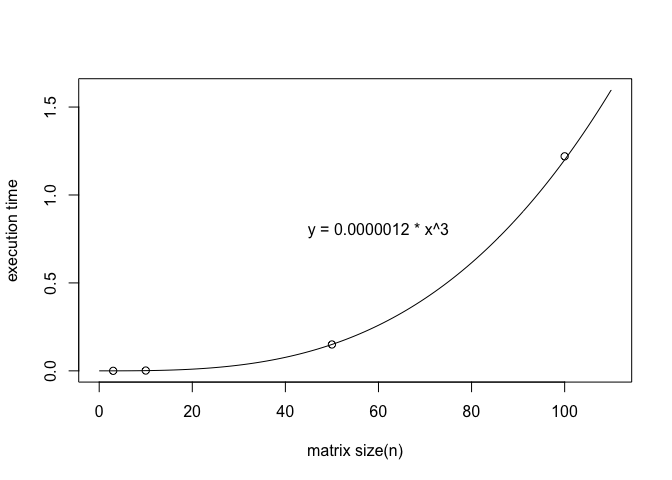

Matrix
======

Matrix size and execution time
------------------------------

平均実行時間は3回の測定の合計の平均（小数第7位四捨五入）

|           |     1回目    |     2回目    |     3回目    | 平均実行時間 |
|:----------|:------------:|:------------:|:------------:|:------------:|
| n = 3     | 0.000061 sec | 0.000053 sec | 0.000052 sec | 0.000055 sec |
| n = 10    | 0.001664 sec | 0.002116 sec | 0.001364 sec | 0.001715 sec |
| n = 50    | 0.161572 sec | 0.139092 sec | 0.149249 sec | 0.149971 sec |
| n = 100   | 1.161494 sec | 1.300774 sec | 1.197255 sec | 1.219841 sec |
| n = 1000  |      be      |      be      |     This     |     This     |
| n = 10000 |     right    |    center    |     This     |     This     |

