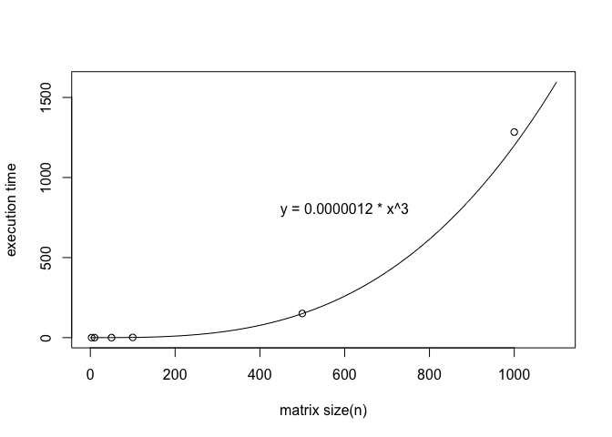

Matrix
======

Matrix size and execution time
------------------------------

平均実行時間は3回の測定の平均（小数第7位四捨五入）

|          |      1回目      |      2回目      |      3回目      |   平均実行時間  |
|:---------|:---------------:|:---------------:|:---------------:|:---------------:|
| n = 3    |   0.000061 sec  |   0.000053 sec  |   0.000052 sec  |   0.000055 sec  |
| n = 10   |   0.001664 sec  |   0.002116 sec  |   0.001364 sec  |   0.001715 sec  |
| n = 50   |   0.161572 sec  |   0.139092 sec  |   0.149249 sec  |   0.149971 sec  |
| n = 100  |   1.161494 sec  |   1.300774 sec  |   1.197255 sec  |   1.219841 sec  |
| n = 500  |  160.879734 sec |  144.592562 sec |  147.082436 sec |  150.851577 sec |
| n = 1000 | 1076.777535 sec | 1093.244503 sec | 1681.788433 sec | 1283.936824 sec |

Graph
-----

`matrix.py`で行列積を求める際にn回ループのfor文を3度回していることから、時間計算量はO(N^3)と予想される。
実測値との調整のため、定数を 0.0000012 とすると、これらより
`y = 0.0000012 * x^3`
のグラフを書くことができ、実行時間を予測することができる。

また、n=3, 10, 50, 100, 500, 1000 での平均実行時間をグラフ上に白丸で示した。

グラフより、実行時間はN^3に比例して増加していることがわかる。

図1: 行列サイズ(n=0~100)に対する実行時間O(n^3)

図2: 行列サイズ(n=0~1000)に対する実行時間O(n^3)
